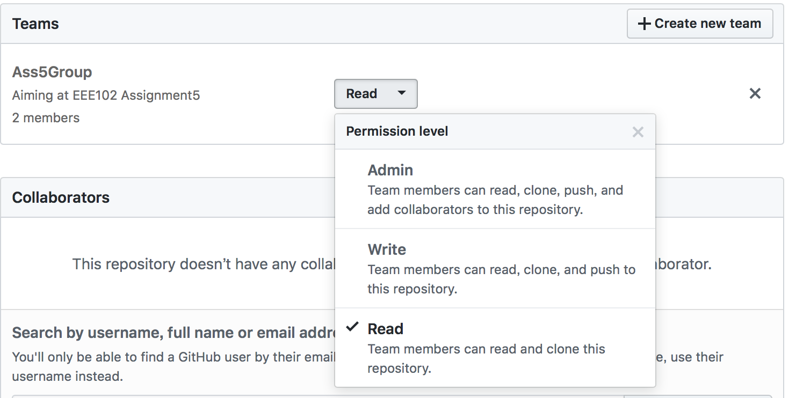
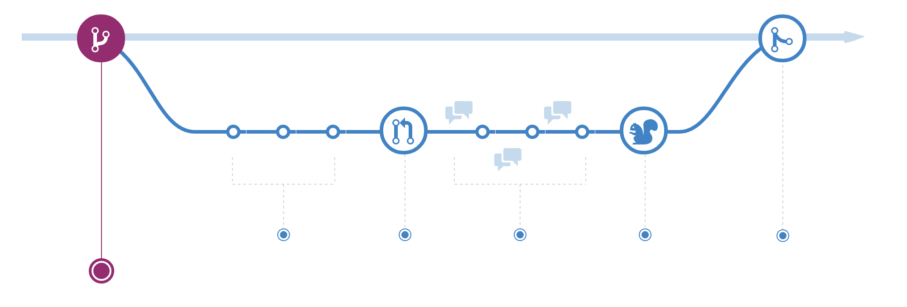
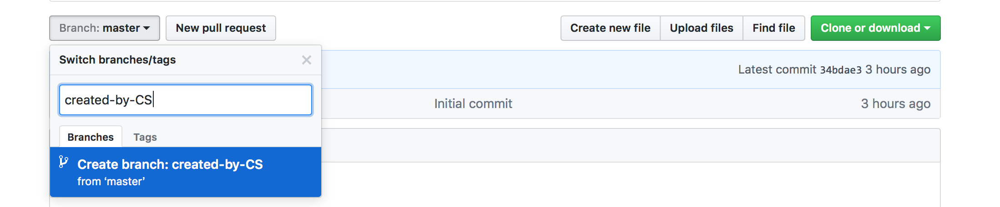
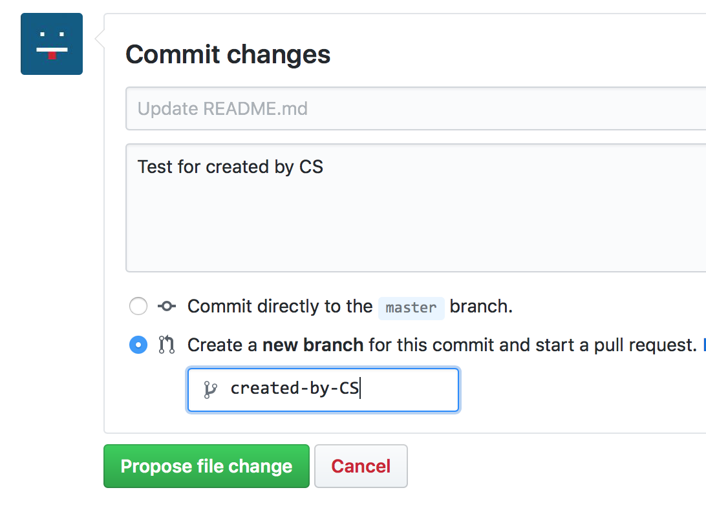
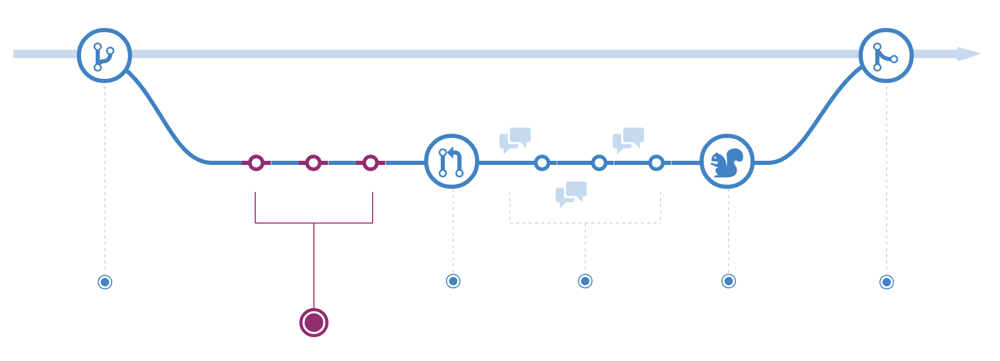
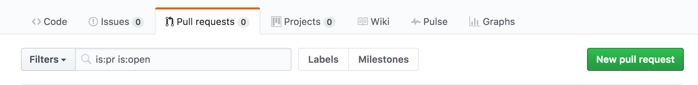
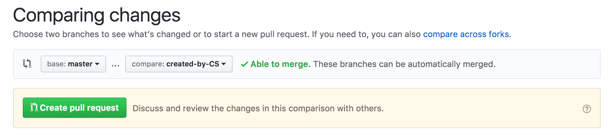
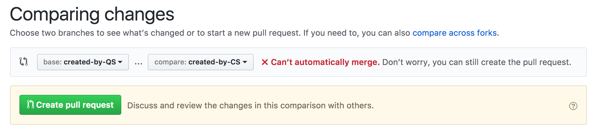
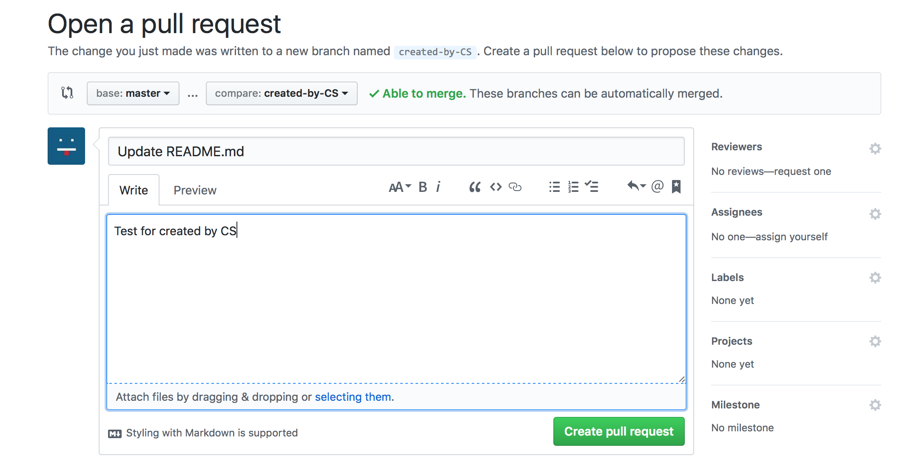

# gitTest

> As we are just using it as a code storage garage, I'm not going to mention too many about the git usage in terminal syntax, but the Github website.

## First — To create a project:

### New repository:

- **Two Methods to Participate:**
  1. User create a repository and invite other users to the same project under one repository.
  2. <u>Someone</u> create an organization and add us all into the organization team. Then, <u>Someone</u> create new repository under this organization account.
     1. Here, the 'Someone' should invite others to a team of the Organization
     2. "Add team" -> "Add a person"
     3. Setting the Teams in the Setting menu, and set the Permission level:
- **How to create:**
  1. Just follow the website and clone it on your github desktop.
  2. Create on your own computer folder and use commands to commit them.
  3. - **Option1:** We will set <u>someone's</u> account as the *Admin level* and all others as *Read level*, so that we can fork the repository and edit it in our own account, adding new branch to it and add it as yourselves like.(To create a new branch later) (This is a good way to clone others virtually complicated project to your own account)
     - **Option2:** We will set  <u>someone's</u> account as the *Admin level* and all others as *Write level*, so that we can all edit the repository, adding new branch directly under the  project, the repository and we all have the permission to merge the branch(I recommend only one or two of us to do this all the time)(To create a new branch later)

## Second — Work in a project:

### Understand Flow:

- **Create a branch**

  

  1. *master branch* is the default branch, which is the main

     > The default branch is considered the “base” branch in your repository, against which all pull requests and code commits are automatically made, unless you specify a different branch.

  2. Other brach can be created by all the team members with 'write level Permission'.

     - How to create a branch:
       1. from the 'Branch' button:
       2. edit and create new branch when you're gonna confirmedly commit it:
     - Here, I have to ask everyone to create a new branch for yourself as: *created-by-XXX*

- **Add commit:**

  

  1. These circles are the stamps of your edition. Once your branch has been created you are starting making changes.

     ```shell
      git add <file/direction>
      git commit -m <Your comment>
     ```

  2. Added commit is not the action to merge your own edited version to the core branch, but a action to record your changes in your own branch.

  3. It is just like 'save' when you're using MS Word.

- **Open a Pull Request:**

  

  1.  This is used to pull a request to merge into the master-branch:

     - A new pull request can created by every one, the branch can from the forked repository in your own account, or from the organization account(when you're one of the organization).

     - Here, we can see two branches wait for you to choose:

       

       **'base' & 'compare'**:  *base* is the branch which is you're aiming to renew; *compare* is the branch which you have altered, the lasted version of your project.

     - After selected these two branch, you can make some comments on the request:

       

     - Arrived here, the pull request is complicated.

  2. Usually, only the project owner himself has the permission to allow others' pull request. However, in our project, as we are all have *Write level permission*, which means we are the owner of the project. Therefore, everyone in the project team list can merge the request.

 
